# 🛍️ ShoppyGlobe Backend

Welcome to the **ShoppyGlobe** backend API – a RESTful service for an e-commerce web application built using **Node.js**, **Express**, and **MongoDB**. This API powers features such as product listings, cart management, user registration & login using JWT-based authentication.

---

## 🚀 Features

- ✅ REST API for managing products and shopping cart
- ✅ User authentication with JWT tokens
- ✅ Secure cart operations accessible only by authenticated users
- ✅ MongoDB integration for persistent storage
- ✅ Input validation and error handling
- ✅ Tested with ThunderClient

---

## 📁 Folder Structure

```bash
shoppyglobe-backend/
│
├── models/            # Mongoose schemas for Product, Cart, User
│   ├── Product.js
│   ├── Cart.js
│   └── User.js
│
├── routes/            # API route handlers
│   ├── productRoutes.js
│   ├── cartRoutes.js
│   └── authRoutes.js
│
├── middleware/        # Custom middleware
│   └── auth.js
│
├── .env               # Environment variables (not committed,)
├── .gitignore
├── app.js             # Express app setup
├── server.js          # Entry point
├── package.json
└── README.md
```

---

## ⚙️ Setup Instructions

### 1. Clone the Repository

```bash
git clone  https://github.com/vandhanchowdhary/ShoppyGlobe-Backend.git
cd shoppyglobe-backend
```

### 2. Install Dependencies

```bash
npm install
```

### 3. Create a `.env` File

In the project root, create a `.env` file and add the following:

```bash
PORT=5000
MONGO_URI=your_mongodb_connection_string
JWT_SECRET=your_jwt_secret
```

> Replace `your_mongodb_connection_string` and `your_jwt_secret` with your actual credentials.

---

## 🧪 API Testing

Use **Thunder Client** or **Postman** to test:

### 🧾 Authentication

```bash
| Route | Method | Description |
|-------|--------|-------------|
| `/api/auth/register` | POST | Register a new user |
| `/api/auth/login`    | POST | Login and get JWT token |
```

### 🛍️ Products

```bash
| Route | Method | Description |
|-------|--------|-------------|
| `/api/products`      | GET | Get all products |
| `/api/products/:id`  | GET | Get product by ID |
```

### 🛒 Cart (Protected)

> Pass `Authorization: Bearer <token>` header.

```bash
| Route | Method | Description |
|-------|--------|-------------|
| `/api/cart`          | POST | Add to cart |
| `/api/cart/:id`      | PUT  | Update quantity |
| `/api/cart/:id`      | DELETE | Remove from cart |
```

---

## 📷 Screenshots

### API Testing (ThunderClient)

#### ✅ Register API

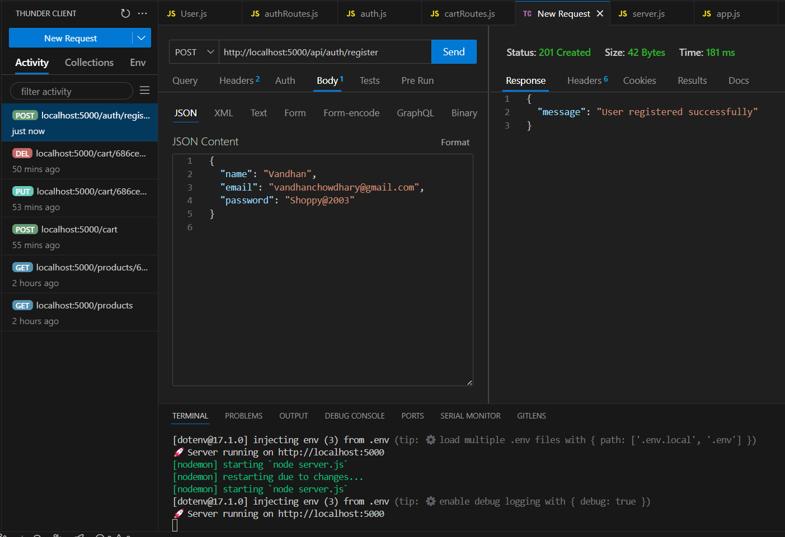

#### ✅ Login API

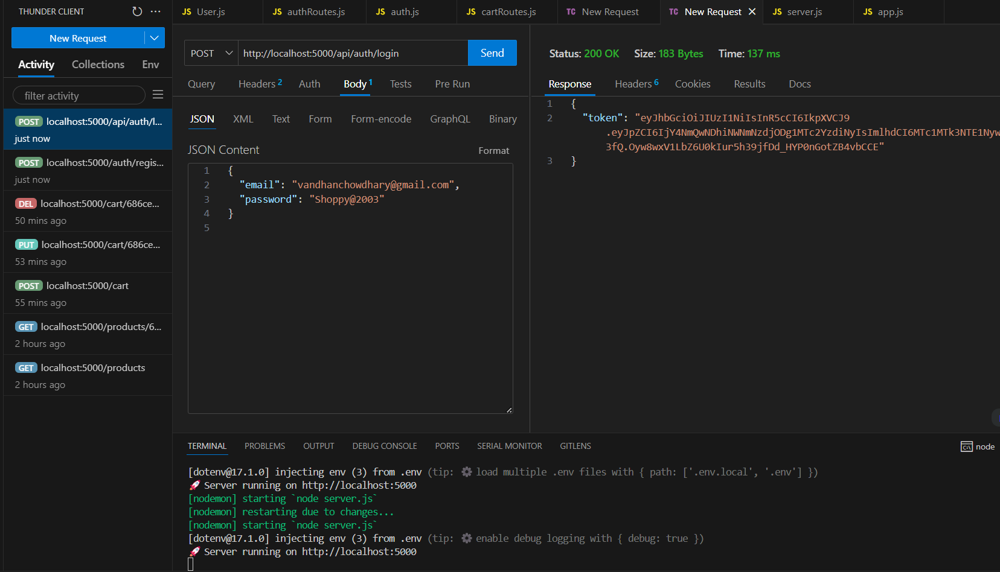

#### ✅ Fetch All Products

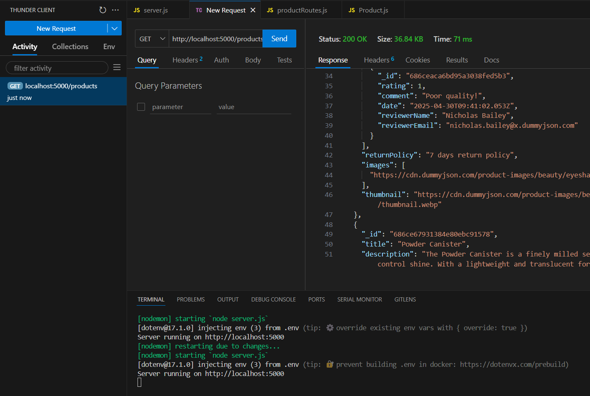

#### ✅ Fetch a Product by its ID

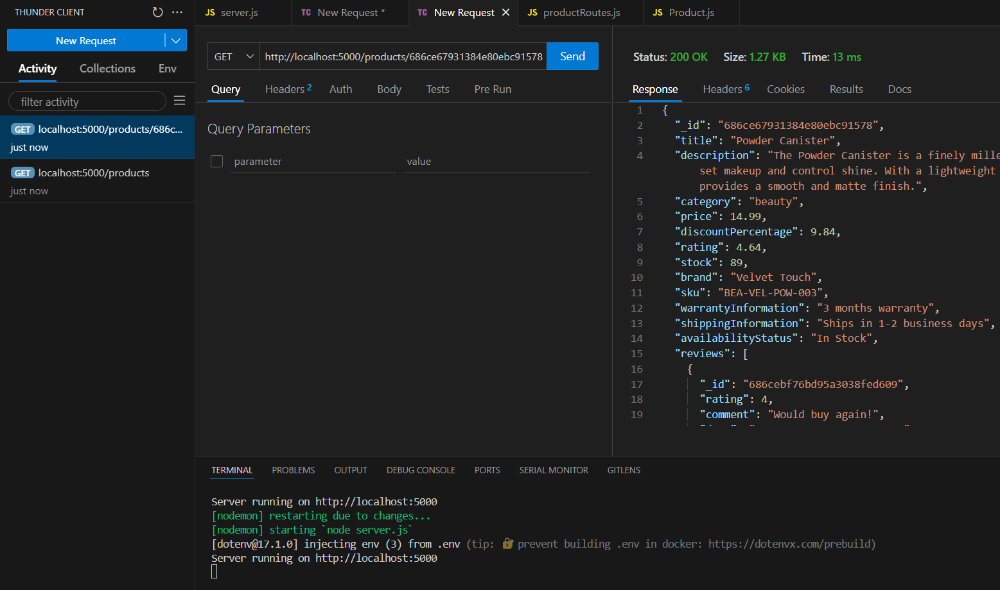

#### ✅ Add a Cart for a Normal User VS Autherised User

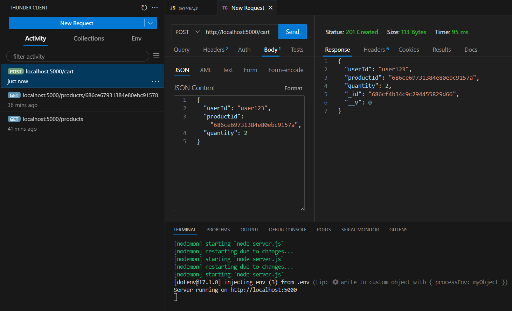
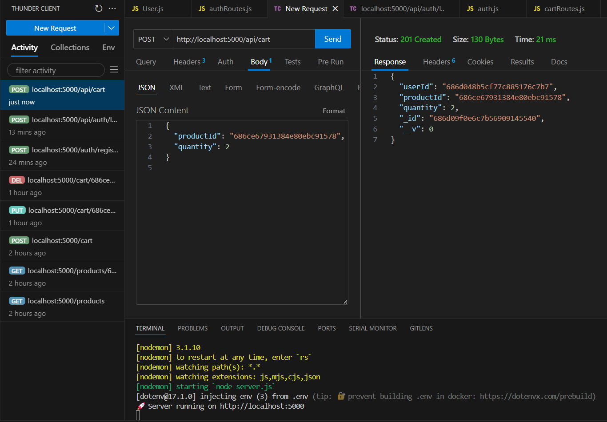

#### ✅ Update Cart for a Normal User VS Autherised user

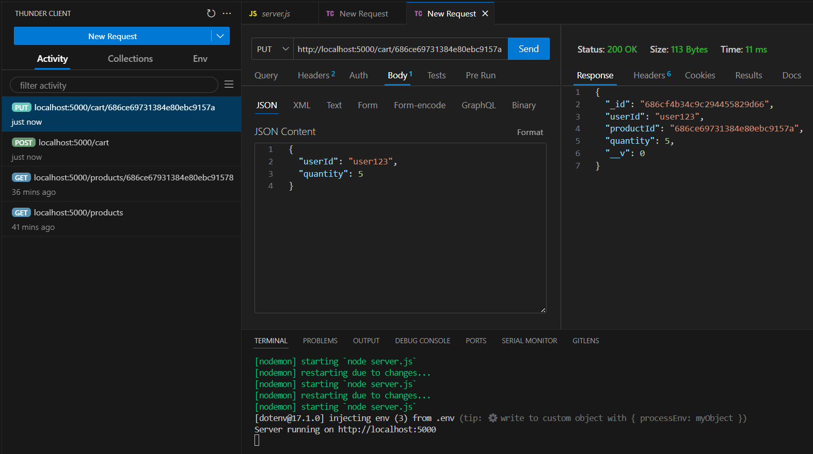
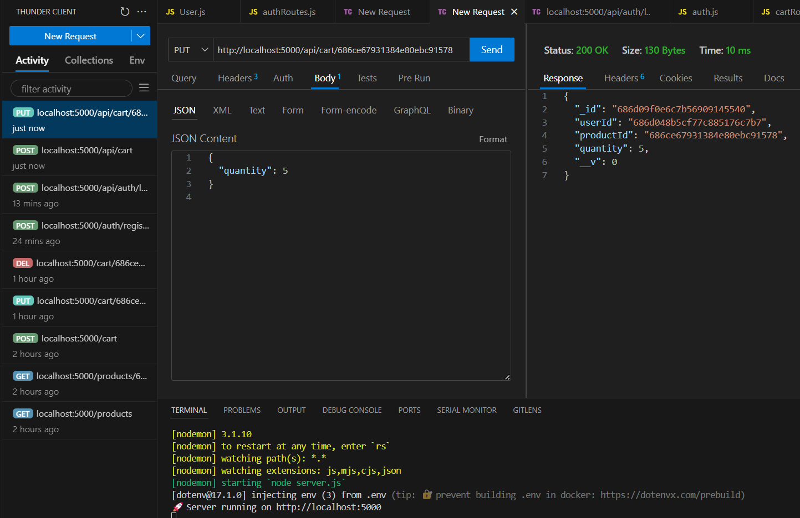

#### ✅ Delete from Cart for a Normal User VS Authorised User

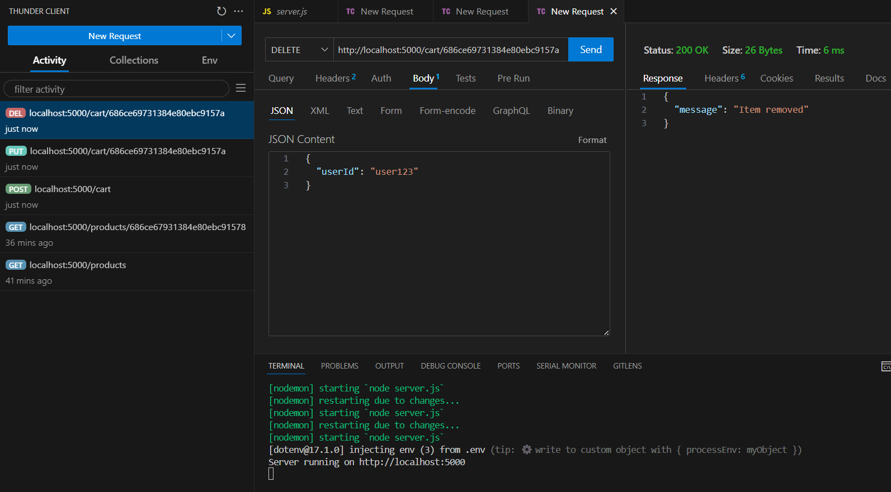
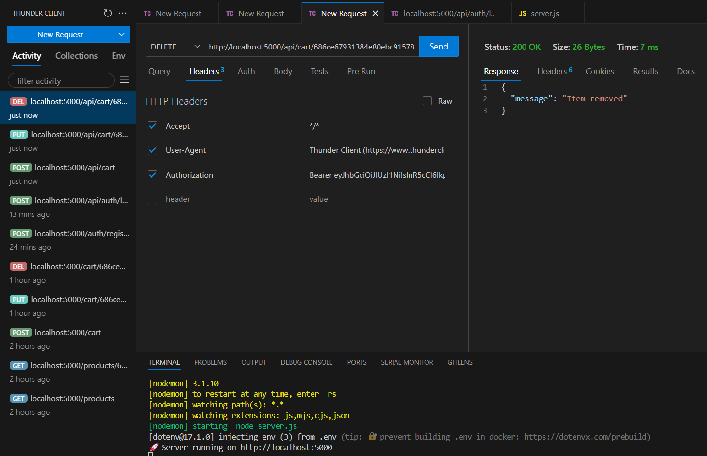

### MongoDB Compass (Dummy data)

#### Data in `products` Collection

##### Data in `List View`

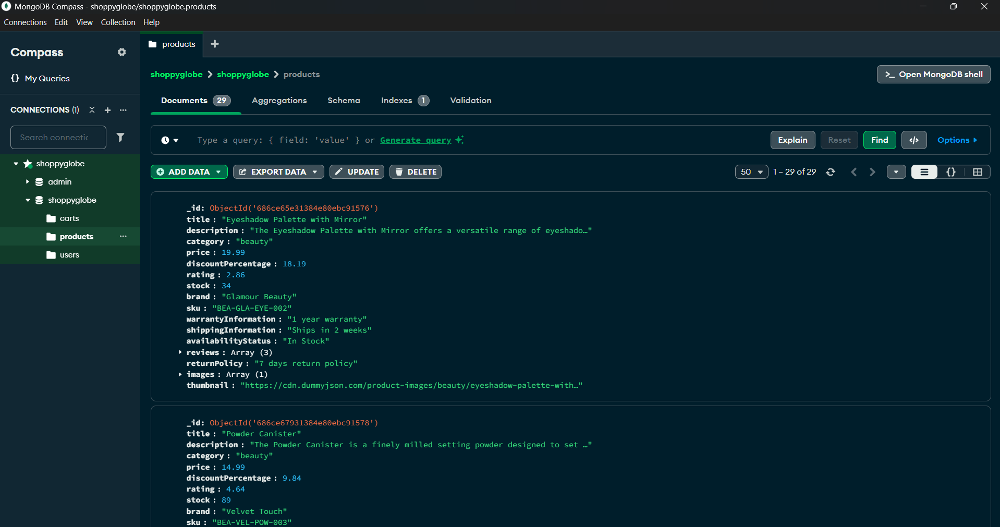

##### Data in `Table View`


---

## 👨‍💻 Technologies Used

- Node.js
- Express
- MongoDB & Mongoose
- JSON Web Tokens (JWT)
- Bcrypt.js
- ThunderClient (for testing)

---

## 📄 License

This project is open-source and available under the MIT License.
